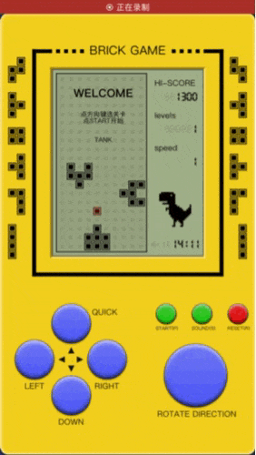
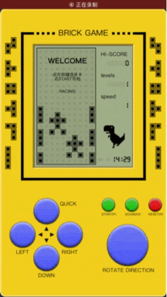
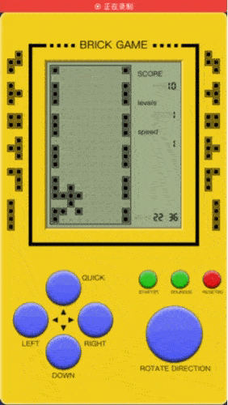
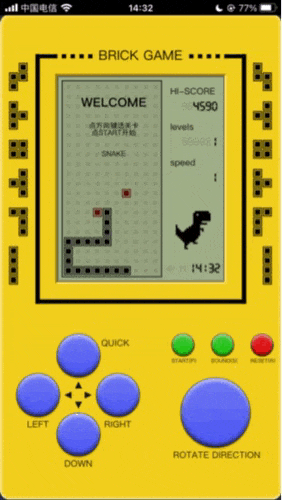
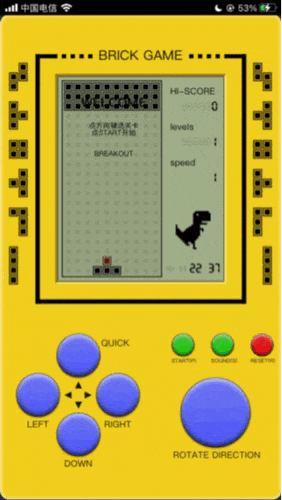

## 用React、Redux做经典的方块游戏

----
本项目灵感来源于 React 版的[俄罗斯方块](https://github.com/chvin/react-tetris),本项目全部用React函数式组件重构，使用Hook模拟生命周期,状态用redux调度

戳：[https://quekaihua.github.io/brick-game/](https://quekaihua.github.io/brick-game/) 玩一玩！

----
### 效果预览


正常速度的录制，体验流畅。

### 坦克大战


### 赛车游戏


### 射击游戏


### 贪吃蛇


### 弹珠游戏


### 响应式


不仅指屏幕的自适应，而是`在PC使用键盘、在手机使用手指的响应式操作`：


### Redux 状态预览（[Redux DevTools extension](https://github.com/zalmoxisus/redux-devtools-extension)）


Redux设计管理了所有应存的状态。


----
## 开发
### 安装
```
npm install
```
### 运行
```
npm start
```
浏览自动打开 [http://127.0.0.1:3000/](http://127.0.0.1:3000/)
### 打包编译
```
npm run build
```

在build文件夹下生成结果。


